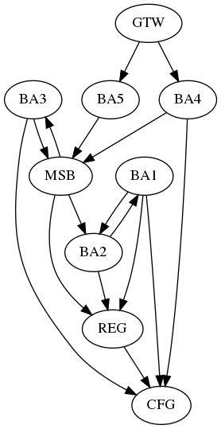

### Research Summary

This experiment was developed as part of a software engineering research project. The research project aims to develop a method for monitoring the evolution of coupling metrics for microservice-based architectures (MSA), assuming it can support software engineers on improving software maintainability. For this, we select the following coupling metrics for MSA found in the research literature \cite{Bogner}.

## Experiment Report

We have designed an experiment for testing the metrics behavior in different scenarios. Due to the lack of open and available repositories with real cases of microservices applications, we worked with synthetic data (artificially-generated dependency graphs) representing microservice architectures to develop the proposed method. Therefore, we developed a tool for generating this data. This simulated environment enabled us to test different scenarios and provided additional insights to make decisions regarding the method development.

### Goal and Hypotheses

This study aims *to analyze* four coupling metrics, *for the purpose of* characterizing *with respect to* their behavior over time, *in the context of* artificially-generated dependency graphs representing MSA releases.
Based on this, we test the following hypotheses for each metric:

Based on this goal, we are testing the following hypotheses:

**Null Hypothesis (H0)**: There **is not** a significant difference in trends in the evolution of the one SID/SDD/ADCS/SCF metric between introducing and removing a architecture smell throughout releases of a MSA.

**Alternative Hypothesis (H1)**: There **is** a significant difference in trends in the evolution of the one SID/SDD/ADCS/SCF metric between introducing and removing a architecture smell throughout releases of a MSA.

## Experimental Design 

We adopted a full factorial design. Table below shows the scenarios resulting from the combinations between the two factors (*Graph Size*, and *Graph Evolution Scenario*) and their levels.

| Scenario | Graph Size | Graph Evolution |
| --- | :---: | :---: |
| 1 | Small| Improvement |
| 2 | Small| Erosion |
| 3 | Medium| Improvement |
| 4 | Medium| Erosion |
| 5 | Large| Improvement |
| 6 | Large| Erosion |

### Graph Structure
The generated dependency graphs need to be as realistic as possible w.r.t. coupling between microservices. In the absence of one specific reference model for microservice-based systems in the literature, we decided to follow the Barabasi-Albert model\cite{Barabasi1999}, which is an algorithm for generating random *scale-free networks* (SFN). SFN is a network whose degree distribution follows a power-law. Wheeldon et al \cite{Wheeldon2003} and Potanin et al. \cite{Potanin2005} verified in real Java programs that distributions of coupling metrics follow a power-law function, i.e., the vast majority classes have few dependencies whilst few classes have many dependencies. Wen et al. \cite{Wen2009} observed that dependencies between Java packages also follow scale-free properties. Many other studies \cite{Vsubelj2012} \cite{Jing2006}, observed that software objects have characteristics of complex networks such as scale-free and power-law. We understand that, semantically, coupling metrics for (micro)services have the meaning than OO coupling metrics. Therefore, all of the dependency graph\gammafollowing the power-law, which the probability of one new node connects with the pre-existing node is 

where  is the number of connections of a node and  is the degree distribution component. In the Figure below, there is an example of a graph for each level.

### Graph Size

A microservice-based system may vary in scale. Netflix and Amazon, pioneers in microservices architecture, claim to have hundreds of microservices in their core products \cite{NetflixMicroservices} \cite{AmazonMicroservices}. On the other hand, in open-source projects, we have many examples of applications that have few microservices, as we can see in "The Microservice Dataset, Version 1.0". \cite{Rahman2019}. 

In our experiment, we create three levels for the size of an application: small, medium and large. As we have no benchmark on the size of microservices application, we made an attempt to defined the application size in terms of amount of services as follows: from five to ten services it is considered a small application; from eleven to twenty-five services it is medium; above 25 is large, however, due to computational restrictions, we decided to limit it to 60 in this experiment, since we intend to evaluate the first results before scaling the number of services. 

### Graph Evolution Scenario

We are interested in how the metrics behave throughout software evolution. We established 21 releases (including the initial release 0) for the whole evolution of one application. The default changes during the evolution are limited to the inclusion of nodes. Additionally, we consider two levels for this factor: an improvement scenario and an erosion one. For the improvement scenario, we introduce one architecture smell in the first release and, during the following releases, the main action is to remove the smell. For the level of erosion of the architecture, the first release is free of architecture smell and, during the following releases, we introduce an architecture smell incrementally.

### Architecture Smells

For the improvement or erosion scenarios, we have chosen two coupling-related architecture problems: the concentration of incoming dependencies (problem 1) and outgoing dependencies (problem 2) around a single microservice. These problems reflect symptoms of known architecture smells with evidence of their existance in the field, such as God Component \cite{Azadi2019} or Megaservice \cite{Taibi2020}\cite{Bogner2019}, Hub-like Dependency \cite{Azadi2019}, Bottleneck Service\cite{Bogner2019}, Nanoservices\cite{Bogner2019} and The Knot\cite{Bogner2019}.

The number of edges to characterize a microservice with high concentration of incoming or outgoing dependencies is defined by a percentage of the total number of services in the system, which is a parameter of this experiment. Further details on experiment parameters and how architecture smells are included and removed from dependency graphs are available in a GitHub\textsuperscript{\ref{githubNote}} repository.

General assumptions in the evolution of architecture: 
1. Both problems are characterized in nodes that have a configured percentage of concentration of outgoing or incoming edges. Therefore, a problem is reached or resolved when it goes up or down this limit. 
2. The evolutions follow a node growth rate calculated randomly for each application within a defined range in minimum and maximum percentage of the application's number of nodes. 
3. After the problem is inserted (worsens) or solved (improves), new nodes are added randomly until the growth rate is reached.

*Architecture improvement scenario*: 
1. Problem 1 is inserted in the graph that represents the first release of the graph and in the next releases the newly added nodes receive half of the input edges of the node with a high concentration of incoming edges an so on. 
2. Problem 2 is inserted in the graph that represents the first release and in the next releases, according to the type of dependency, a node can be excluded (simulating the joining of services) or edges can be excluded.

*Architectural worsening scenario*: 
1. New nodes are inserted with an outgoing edge for the selected node to be the bearer of problem 1. 
2. Newly nodes are inserted with an incoming edge from the selected node to be the bearer of the problem 2.

### Microservices-related Design Patterns

Aiming at generating dependency graphs similar to real microservice-based systems, we apply six usual design patterns found in microservice-based software applications \footnote{https://microservices.io/} and that can also be expressed in a dependency graph. The selected patterns are API Composition, Message Service Broker, Externalized Configuration, API Gateway, Service Registry, and Distributed Tracing. We know that some design patterns can increase coupling and also concentrate incoming or outgoing edges on a few nodes. Therefore, the method is applied to the evolution of metrics values, performing the comparison with itself, thus avoiding the creation of generic thresholds that fail to consider the different architectural decisions of each software. 
The configurations related to the inclusion of these design patterns are available in the GitHub\textsuperscript{\ref{githubNote}} repository.

### Replications and Procedure

We need multiple trials as we have stochastic components to generate graphs, so that we can quantify variation in the results. 
To determine the minimum number of replications we adopted the procedure in \cite{Law2013}. 
After executing this procedure, we reached the amount of 210 replications. Based on this, we followed the experimental procedure:
* *Graph Generation*: based on the factors and levels, the tool generates the dependency graph corresponding to the first release of each MSA. As we have 6 scenarios and 210 replications each, we generated 1260 experimental units. For all the units in the improvement scenario, we introduced one architecture smell in the first release.
* *Application evolution*: according to the evolution scenario, the tool generates a dependency graph for each of the next 20 releases.
* *Metrics calculation*: the metrics are calculated for each release of each MSA. 
* *Metrics analysis*: we used the Cox-Stuart test to detect trends for each experimental unit, being ten statistical tests per unit considering a range of 12 observations per test. Additionally, we explore trends for the scenarios visually using the mean values for the coupling metrics evolution.
* *Hypothesis testing*: we used the *Chi-Square* Test of Independence to evaluate the experimental hypotheses for each individual replication. Also, we used the Cramér's V statistic as the *Chi-Square* Test is sensitive to large sample sizes.

## Experimental Results

Firstly, we analyze the general behavior of the metrics. For each scenario, we grouped the metric values of all replications, and we calculated the mean values for each release as they are independent. Figure below shows the plot of the four metrics for the scenario using graphs of medium size as an 
example of how we can get a visual sense of the metrics with most evident upward or downward trends.

In this analysis, the SCF metric presents a downward trend in all scenarios, even when purposefully introducing smells. Therefore, it is not sensitive enough to detect the architecture changes introduced during the experiment. The SCF metric seems to be more sensitive to the number of nodes in the graph than to the coupling between them, since the average number of edges does not vary significantly during evolution. An increase in SCF would reveal a chaotic architecture, where it should be evident the architecture remarkably deteriorated. 

We also realized the vast majority of cases in architectural erosion scenarios present an upward trend. In contrast, for ten improvement scenarios, trends are difficult to be identified only by visual analysis. In general, the SID and SDD metrics seem to be good indicators for the architecture smells, as their trends are easier to detect when there is a concentration of input or output edges in few nodes. 
The ADCS metric shows more considerable differences in behavior according to the size of the application, 
performing better for small applications.

We use Cox-Stuart test to characterize statistically a trend (upward or downward) in the series metrics values through the releases. In this experiment, we performed ten trend tests for each experimental unit (MSA), considering all possible intervals of 12 releases length (from release  to  successively). For each scenario, we determined a contingency table similar to Table~\ref{tab:contingencyTable}.

TABELAS

For each MSA, we count as *Improve Scenario* and *Improving Trend* when at least one of the ten tests resulted in Improving Trend. For instance (in Table~\ref{tab:contingencyTable}), the evolution of 60 applications reveals a significant improving trend for the SID metric when we remove the architecture smell. The same is valid for counting as *Erosion Scenario* and *Erosion Trend*; that is when at least one of the ten tests resulted in Erosion Trend. Similarly, from 210 unities (MSA) in the erosion scenario, SID revealed a significant increase for 198 MSAs.

We justify this rationale as just one single intervention is made to improve or deteriorate the application, so it must affect the series in a unique change-point. Conversely, *Improve Scenario* and *Erosion Trend* will be computed when there is at least one test resulting in Erosion Trend and none resulting in Improving Trend. The opposite case (*Erosion Scenario* and *Improving Trend*) occurs when there is at least one test resulting in Improving Trend and none Erosion Trend. Finally, we count as \emph{No Trend} only when all ten tests result in No Trend, i.e., it has no statistical significance.

Based on the contingency table for each scenario, we used the Chi-Square test of independence to verify how correlated are the intended evolution scenarios (Improve or Erosion) and the result of the Cox-Stuart test for trend analysis (results in Table~\ref{tab:calculatedMetrics}). We do not consider the SCF metric for testing the experiment's hypotheses due to its anomalous behavior (monotonic-decreasing no matter the scenario), which is also reflected in Table~\ref{tab:contingencyTable}.

Table~\ref{tab:calculatedMetrics} also presents the Cramer's V measure. We use it in association with the Chi-Square test as the latter is sensitive to large sample sizes. The Cramer's V measures the correlation between two nominal variables (architectural evolution scenario and detected trends) for each coupling metric as an interval between zero (no association) and one (strong association). We consider rejecting the null hypothesis when the Chi-Square test (\emph{p-value} < 0.05) and the Cramer's V statistic ($\varphi_c > 0.5$) result in a significant association. 

Therefore, we could not reject **H0** in the scenarios: SID metric with small MSAs and SDD metric with small MSAs. Except for these two combinations of metrics and scenarios, we can reject **H0** and accept the **H1** for the other 10 combinations (metrics x MSA size). 

The SDD metric for large graphs shows great results, since Cramér's V points to a strong correlation (0.78). The SID metric also has good results, mainly for large and medium MSAs. The ADCS metric seems to work appropriately for all MSA sizes.

The results presented help us to discard the use of the SCF metric and to validate the use of statistical trend calculations.

## Threats to Validity

We have no empirical evidence whether the model we used to create and evolve the graph structures used in the experiment resembles the graph structures of real MSAs. However, we do have evidence on this for other types of software. In architectural terms, the main difference is that MSAs have an extra level of abstraction (services).

In the wild scenario, several problems can occur together, and there may be problems that can cancel each other's effects. However, the controlled use of architecture smells in this experiment gives us the advantage of isolating the causes of metrics deterioration.

The trend analysis is effective but does not take into account *level changes* in a time series, and can cause misinterpretations when this occurs. We mitigate this by using several intervals for a single evolution, so that we could detect multiple change points.

Finally, the *Chi-Square* Test is sensitive to large sample sizes like the one we have in the experiment design considering the number of replications. Thus, it may impose a threat to conclusion validity. However, we associated the Cramér's V statistic to support the effect size analysis. Besides, the Chi-Square test statistic represent the independence magnitude, from which we can highlight the difference across the three metrics, corroborating the results in Table~\ref{tab:calculatedMetrics} and discussion. 
