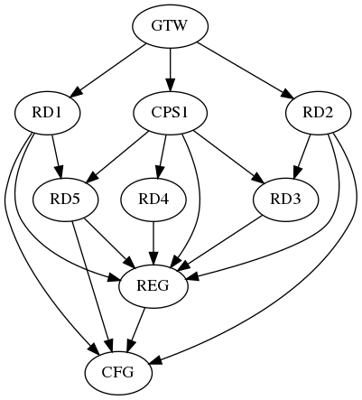
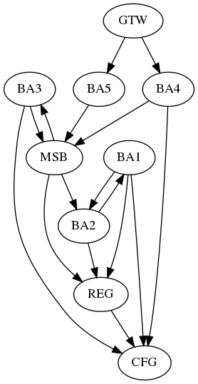

# microservices-graph-generator

Microservices Dependencies Graph Generation Tool

## Implementation Details ##

### Technologies used ###

We used the graph algorithms contained in the JGraphT library to generate the initial dependencies graphs. For the random graphs, we utilized the GnpRandomGraphGenerator class that follows the Erdős–Rényi model [[1]](#1). For the Barabasi Albert graphs, we utilized the BarabasiAlbertGraphGenerator class [[2]](#2) that implements preferential attachment growth. 

### Microservices-related Design Patterns ###

Aiming at generating dependency graphs similar to real microservice-based systems, we apply six usual design patterns found in microservice-based software applications. We selected them from the catalog in [[3]](#3).
Thus, the main selection criterion is their possibility to be expressed in a dependency graph. The selected patterns are: API Composition, Event Domain, Externalized Configuration, API Gateway, Service Registry, and Distributed Tracing. These patterns are commonly adopted together, using for example the Netflix microservices components [[4]](#4).

To diversify the creation of graphs, each design pattern has a probability of being introduced in the generated graph. The table~\ref{tab:settingParameters} describes all the configurations related to the design patterns to generate and evolve the graphs. 
For example, if API Composition is configured with a 50\% percentage of probability, half of the generated graphs will have this pattern included. Some design patterns are applied only to a set of services in an application. Consequently, we created a configuration related to the proportion of nodes that will participate in the applied standard. Therefore, in these cases, there is a percentage range that is randomly chosen for each graph generated that will be used to calculate the number of nodes who have the design pattern applied.

After the basic graph is generated by the algorithms, our tool includes the nodes related to the design patterns. We can note this in the Figure~\ref{fig:dependency-graphs-samples} that presents nodes with the labels: GTW (Gateway), CPS (API Composition), REG (Service Registry), MSB (Message Service Broker) e CFG (External Configuration). 

### Generated Graphs Samples ###

**a)** *Random Graph Sample*

**b)** *Barabasi-Albert Sample*

### Tool Configurations ###
Tool configurations related to the dependency graph generation and evolution:

| Parameter | Value | Description |
| --- | :---: | --- |
| Minimum growth rate | 30\% | Minimum percentage of nodes to be included in the evolution.|
| Maximum growth rate | 80\% | Maximum percentage of nodes to be included in the evolution.|
| Service Registry Probability | 100\% | Probability of a microservice application to implement the Service Registry pattern.|
| API Gateway Probability | 80\% | Probability of a microservice application to implement the API Gateway pattern.|
| API Gateway Ratio | 20\% | The ratio of nodes to be composed.|
| API Composition Probability | 50\% | Probability of a microservice application has at least one compositon service.|
| Distributed Tracing Probability | 50\% | Probability of a microservice application has one service for Distributed Tracing.|
| Event Domain Probability | 50\% | Probability of a microservice application to implement the event domain pattern.|
| Event Domain Ratio | 50\% | Probability of one service using the message broker.|
| Externalized Configuration Probability | 50\% | Probability of a microservice application to implement externalized configuration pattern.|
| Externalized Configuration Ratio | 40\% | Ratio of nodes using the externalized configuration.|
| Connected nodes range for megaservice | 30-80\% | One node is a megaservice if a percentage of all nodes of this application call this service.|

### Graph Dependency Evolution ###

In this experiment, we established twenty releases (beyond the initial release) for the whole evolution of one application. The default changes during the evolution are limited to inclusion of nodes. We focus on implementing a simple evolution of a dependency graph through releases. We calculate the growth rate for each experimental unit that must be a percentage of nodes randomly chosen from a predefined range. After the number of new nodes to be added is calculated, we apply a distribution of the nodes into the number of releases. This distribution is random and balanced to avoid all the nodes to be included in a single release, considering a short iteration development. The number of releases is also taken into account. 

### Architecture Smells ###

The evolution of a dependency graph through releases in this experiment follows the architectural improvement or the architectural erosion scenario. For this, we have chosen one architecture smell (problem) to use in our evolution scenario. We chose the megaservice problem that is similar to the \emph{God Class} in OO programming. The main characteristic of a \emph{god class} is the accumulation of responsibilities causing an increase in size and amount of dependencies. In the literature, this architecture smell can be found under different names [[5]](#5) [[6]](#6) [[7]](#7) [[8]](#8)\cite{Taibi2018} \cite{Taibi2020} \cite{Azadi2019} \cite{Bogner2019}. 
% In the case of microservices, Taibi et al. \cite{Taibi2018} \cite{Taibi2020} reports that the megaservice smell is one of the main anti-patterns problems stated by practitioners. Azadi et al \cite{Azadi2019} used the God Component denomination as one of the architectural smells detected by the analyzed tools. In \cite{Bogner2019} Bogner et al. there is a categorization of this problem in service-based systems and, according to the literature, there are several different names found for this problem, such as Multiservice, The God Object, God Object Web Service, and Big Ball of Mud.

In OO programming, there are different methods to identify a god class. Generally, these methods use coupling and cohesion metrics related to the classes and their methods. For service-based systems, we did not find methods to detect a megaservice at the level of dependencies of services only. Also, we do not have any reference to a typical dependency graph representing a megaservice. Therefore, we assume a megaservice as a node (representation of microservice in a dependency graph) that has many input edges. The number of entry edges for each megaservice will be defined by a percentage of the number of services in the system within a configured range. 

The architectural improvement scenario will be characterized by the decomposition of features of a megaservice in other services, thus balancing incoming calls. This decomposition will be done throughout the releases until there are no more nodes considered megaservices. In the architectural erosion scenario, after selecting a node to be a megaservice, the main action in the next releases is to include new nodes with edges that invoke the selected megaservice, thus representing the accumulation of responsibilities.

### References ###
<a id="1">[1]</a> 
Erdős, P., & Rényi, A. (1960). On the evolution of random graphs. Publ. Math. Inst. Hung. Acad. Sci, 5(1), 17-60.

<a id="2">[2]</a> 
https://jgrapht.org/javadoc/org/jgrapht/generate/BarabasiAlbertGraphGenerator.html

<a id="3">[3]</a> 
“Microservices.io website,” [Online] [Accessed: 15-Feb-2020]. [Online].
Available: https://microservices.io/

<a id="4">[4]</a> 
https://netflix.github.io/

<a id="5">[5]</a>
D. Taibi and V. Lenarduzzi, “On the definition of microservice bad
smells,” IEEE software, vol. 35, no. 3, pp. 56–62, 2018.

<a id="6">[6]</a>
D. Taibi, V. Lenarduzzi, and C. Pahl, “Microservices anti-patterns: A
taxonomy,” in Microservices. Springer, 2020, pp. 111–128.

<a id="7">[7]</a>
U. Azadi, F. A. Fontana, and D. Taibi, “Architectural smells detected
by tools: a catalogue proposal,” in 2019 IEEE/ACM International
Conference on Technical Debt (TechDebt). IEEE, 2019, pp. 88–97.

<a id="8">[8]</a>
J. Bogner, T. Boceck, M. Popp, D. Tschechlov, S. Wagner, and A. Zim-
mermann, “Towards a collaborative repository for the documentation of
service-based antipatterns and bad smells,” in 2019 IEEE International
Conference on Software Architecture Companion (ICSA-C).
IEEE,
2019, pp. 95–101.
